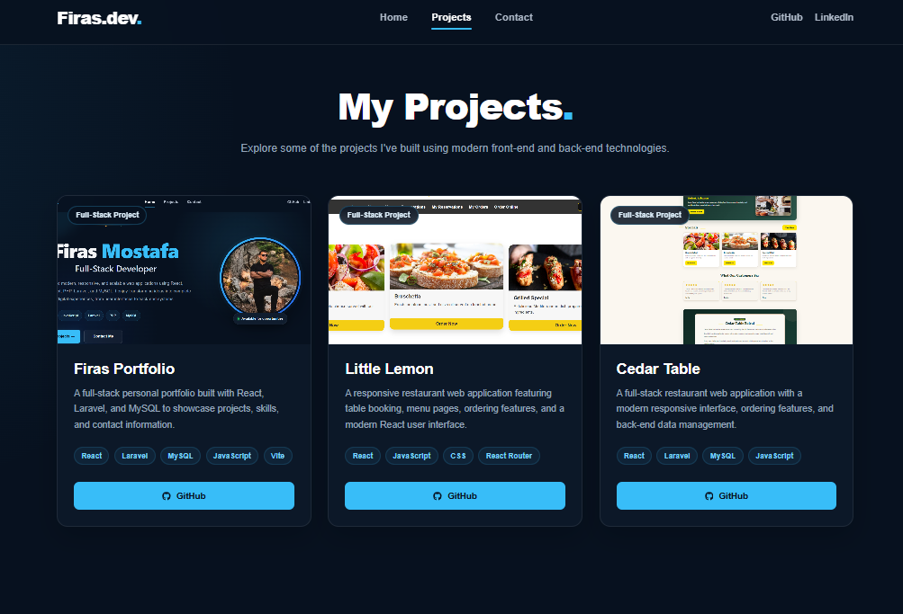
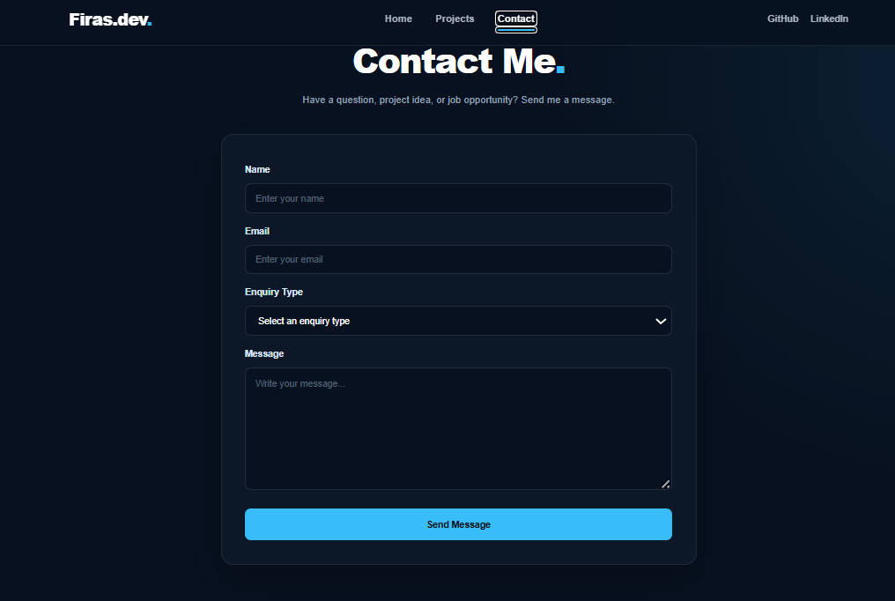

# Firas Portfolio — Full-Stack Developer Portfolio

A modern full-stack developer portfolio built to showcase my projects, technical skills, and experience.

The application combines a responsive React front end with a Laravel REST API and MySQL database. It also includes a functional contact system that stores messages in the database and sends email notifications.

---

## Features

- Modern responsive user interface
- Mobile-friendly design
- Separate Home, Projects, and Contact pages
- Dynamic project data loaded from Laravel API
- Full-stack contact form
- Form validation using Formik and Yup
- Contact messages stored in MySQL
- Email notifications through Laravel Mail
- Responsive project cards
- GitHub and LinkedIn integration
- Social and contact links
- Custom favicon and social sharing image
- REST API architecture

---

## Tech Stack

### Front End

- React
- Vite
- JavaScript
- HTML5
- CSS3
- React Router
- Formik
- Yup
- React Icons

### Back End

- PHP
- Laravel
- REST API
- Laravel Mail

### Database

- MySQL

### Tools

- Git
- GitHub
- VS Code
- npm
- Composer

---

## Project Structure

```text
firas-portfolio-fullstack/
│
├── frontend/
│   ├── public/
│   ├── src/
│   │   ├── components/
│   │   └── pages/
│   └── package.json
│
├── backend/
│   ├── app/
│   ├── database/
│   ├── resources/
│   ├── routes/
│   └── composer.json
│
└── README.md
```

---

## Projects Showcased

### Firas Portfolio

Full-stack personal portfolio built using React, Laravel, and MySQL.

**Technologies:** React, Laravel, MySQL, JavaScript, Vite

### Little Lemon

Responsive restaurant application featuring table booking, menu pages, and a modern React interface.

**Technologies:** React, JavaScript, CSS, React Router

### Cedar Table

Full-stack restaurant application with a modern responsive interface, ordering functionality, and back-end data management.

**Technologies:** React, Laravel, MySQL, JavaScript

---

## Contact System

The contact form demonstrates full-stack communication between the client and server.

```text
React Contact Form
        ↓
Laravel REST API
        ↓
Validation
       ↙ ↘
   MySQL   Email
```

When a visitor submits the form:

1. React sends the form data to the Laravel API.
2. Laravel validates the request.
3. The message is stored in MySQL.
4. Laravel sends an email notification.
5. The front end displays the submission status.

Sensitive email credentials are stored in the local `.env` file and are not committed to Git.

---

## Running the Project Locally

### 1. Clone the repository

```bash
git clone https://github.com/firasmostafa/firas-portfolio-fullstack.git
```

Then:

```bash
cd firas-portfolio-fullstack
```

---

## Frontend Setup

```bash
cd frontend
npm install
npm run dev
```

The React development server will normally run at:

```text
http://localhost:5173
```

---

## Backend Setup

Open another terminal:

```bash
cd backend
composer install
```

Create your environment file:

```bash
cp .env.example .env
```

On Windows PowerShell you can use:

```powershell
Copy-Item .env.example .env
```

Generate the application key:

```bash
php artisan key:generate
```

Configure your MySQL database in `.env`, then run:

```bash
php artisan migrate
```

To populate the project data:

```bash
php artisan db:seed --class=ProjectSeeder
```

Start Laravel:

```bash
php artisan serve
```

The API will normally be available at:

```text
http://127.0.0.1:8000
```

---

## Environment Variables

The real `.env` file is intentionally excluded from this repository.

Configure values such as:

```env
DB_CONNECTION=mysql
DB_HOST=127.0.0.1
DB_PORT=3306
DB_DATABASE=your_database
DB_USERNAME=your_username
DB_PASSWORD=your_password
```

For email functionality, configure your own SMTP credentials.

Never commit passwords, API keys, App Passwords, or other secrets to GitHub.

---

## API

Projects:

```text
GET /api/projects
```

Contact messages:

```text
POST /api/messages
```

Example contact request:

```json
{
  "name": "Example User",
  "email": "user@example.com",
  "enquiry": "project",
  "message": "I would like to discuss a new web development project."
}
```

---

## Responsive Design

The interface is optimized for:

- Desktop
- Laptop
- Tablet
- Mobile

---
## Screenshots

### Home
.png)

### Projects


### Contact

## Developer

**Firas Mostafa**  
Full-Stack Developer

GitHub: https://github.com/firasmostafa

LinkedIn: https://www.linkedin.com/in/firas-mostafa-b71843345

---

## Repository

https://github.com/firasmostafa/firas-portfolio-fullstack

---

## License

This project is intended for portfolio and educational purposes.

---

Built with React, Laravel, and MySQL.